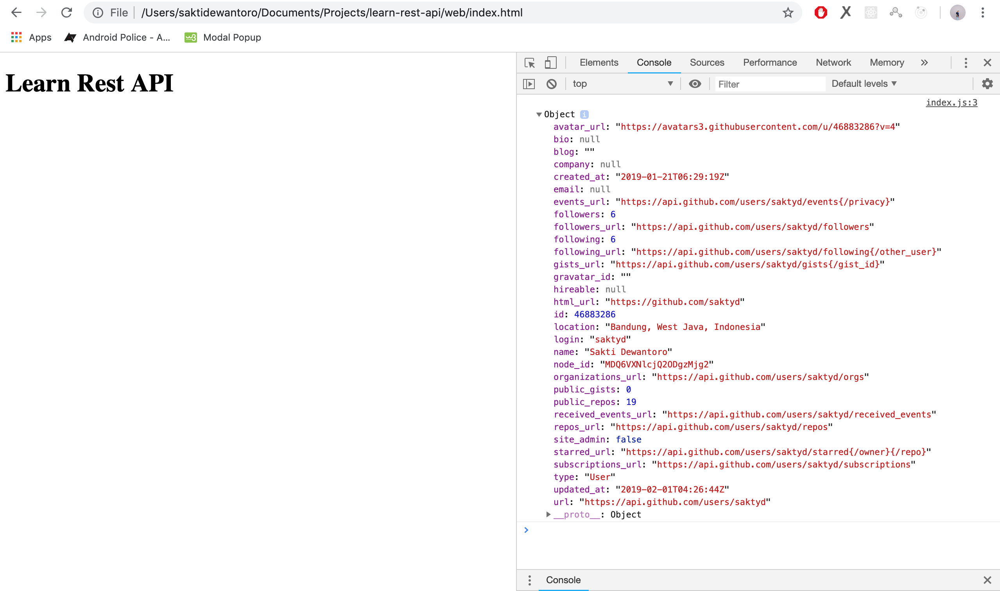

# Learn REST API

## In Web Browser

```sh
npm start:web
# live-server web
# open in localhost:8080
```

Result:



## In Node.js Server

```sh
yarn start:server
npm run start:server
# node server
```

Result:

```json
{
  "login": "saktyd",
  "id": 46883286,
  "node_id": "MDQ6VXNlcjQ2ODgzMjg2",
  "avatar_url": "https://avatars3.githubusercontent.com/u/46883286?v=4",
  "gravatar_id": "",
  "url": "https://api.github.com/users/saktyd",
  "html_url": "https://github.com/saktyd",
  "followers_url": "https://api.github.com/users/saktyd/followers",
  "following_url": "https://api.github.com/users/saktyd/following{/other_user}",
  "gists_url": "https://api.github.com/users/saktyd/gists{/gist_id}",
  "starred_url": "https://api.github.com/users/saktyd/starred{/owner}{/repo}",
  "subscriptions_url": "https://api.github.com/users/saktyd/subscriptions",
  "organizations_url": "https://api.github.com/users/saktyd/orgs",
  "repos_url": "https://api.github.com/users/saktyd/repos",
  "events_url": "https://api.github.com/users/saktyd/events{/privacy}",
  "received_events_url": "https://api.github.com/users/saktyd/received_events",
  "type": "User",
  "site_admin": false,
  "name": "Sakti Dewantoro",
  "company": null,
  "blog": "",
  "location": "Bandung, West Java, Indonesia",
  "email": null,
  "hireable": null,
  "bio": null,
  "public_repos": 19,
  "public_gists": 0,
  "followers": 6,
  "following": 6,
  "created_at": "2019-01-21T06:29:19Z",
  "updated_at": "2019-02-01T04:26:44Z"
}
```
